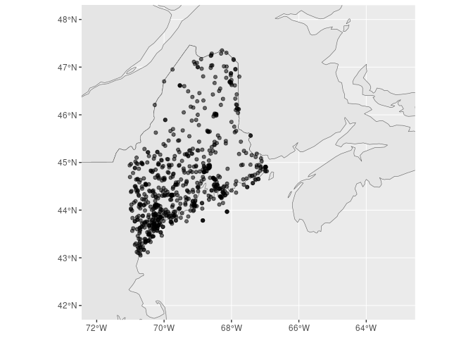

homr
================

``` r
suppressPackageStartupMessages({
  library(rnaturalearth)
  library(rnaturalearthdata)
  library(homr)
  library(sf)
  library(ggplot2)
  library(dplyr)
  })
```

An R package for querying and accessing [Historical Observing Metadata
Repository](https://www.ncei.noaa.gov/access/homr/api).

Search within a state; it is much faster when `headerOnly = TRUE`. Note
that we include the option to attach (as an attribute) the definitions
table. It’s not clear how this might be useful, but it is available. By
default `include_definitions = FALSE`.

``` r
x = query_search(headersOnly = "true", state = "ME", include_definitions = TRUE) |>
 glimpse()
```

    ## Rows: 695
    ## Columns: 6
    ## $ ncdcStnId     <chr> "30041258", "30129451", "30146634", "30071850", "3007409…
    ## $ preferredName <chr> "SCARBOROUGH 3.0 SSE, ME", "DEDHAM 5.7 ESE, ME", "LIBBY …
    ## $ precision     <chr> NA, NA, NA, NA, NA, NA, NA, NA, NA, "DDMM", "DDMM", "DDM…
    ## $ beginDate     <chr> "2011-03-01T00:00:00.000", "2021-06-03T00:00:00.000", "1…
    ## $ endDate       <chr> "2011-06-17T00:00:00.000", "Present", "1983-12-31T00:00:…
    ## $ geometry      <POINT [°]> POINT (-70.307 43.5587), POINT (-68.54425 44.67663…

Above you’ll note that `startDate` and `endDate` are both character
type. That’s because the are entries like ‘present’ and ‘unknown’.

Below we show the definitions table.

``` r
attr(x, 'homr_definitions') |>
  glimpse()
```

    ## Rows: 309
    ## Columns: 7
    ## $ defType     <chr> "ids", "ids", "ids", "ids", "ids", "ids", "ids", "ids", "i…
    ## $ abbr        <chr> "GHCND", "COOP", "WBAN", "FAA", "ICAO", "TRANS", "NWSLI", …
    ## $ fullName    <chr> "GHCND IDENTIFIER", "COOP NUMBER", "WBAN NUMBER", "FAA LOC…
    ## $ displayName <chr> "GHCND ID", "COOP ID", "WBAN ID", "FAA ID", "ICAO ID", "Tr…
    ## $ description <chr> "GLOBAL HISTORICAL CLIMATOLOGY NETWORK - DAILY (GHCND) IDE…
    ## $ cssaName    <chr> NA, NA, NA, NA, NA, NA, NA, NA, NA, NA, NA, NA, NA, NA, NA…
    ## $ ghcndName   <chr> NA, NA, NA, NA, NA, NA, NA, NA, NA, NA, NA, NA, NA, NA, NA…

We can map these…

``` r
world <- ne_countries(scale = "medium", returnclass = "sf")
ggplot(data = world) +
  geom_sf() +
  xlim(-72, -63) +
  ylim(42, 48) +
  geom_sf(data = x, aes(alpha = 0.5)) +
  theme(legend.position = "none") 
```

<!-- -->
