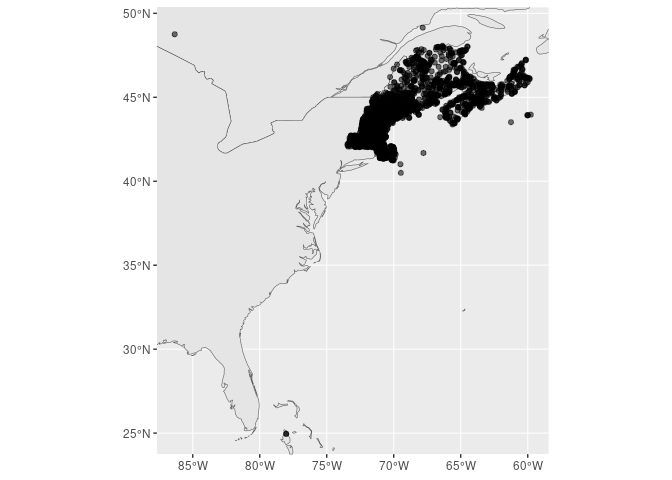

homr
================

An R package for querying and accessing [Historical Observing Metadata
Repository](https://www.ncei.noaa.gov/access/homr/api). + [R
v4.1+](https://www.r-project.org/) +
[rlang](https://CRAN.R-project.org/package=rlang) +
[httr](https://CRAN.R-project.org/package=httr) +
[sf](https://CRAN.R-project.org/package=sf) +
[dplyr](https://CRAN.R-project.org/package=dplyr)

### Simple usage

``` r
suppressPackageStartupMessages({
  library(rnaturalearth)
  library(rnaturalearthdata)
  library(homr)
  library(sf)
  library(ggplot2)
  library(dplyr)
  })
```

Search for sites within a state.

##### Tip - speed your searches

It is much faster when you specify `headerOnly = TRUE` (which is the
default).

##### Tip - optionally retrieve a table of definitions

Note that for demonstration purposes we include the option to attach (as
an attribute) the definitions table. It’s not clear how this might be
useful, but it is available. By default `definitions = FALSE` so it is
not included.

``` r
x = query_search(state = "ME", definitions = TRUE) |>
 glimpse()
```

    ## Rows: 695
    ## Columns: 6
    ## $ ncdcStnId     <chr> "12002245", "20009704", "20009741", "20009757", "2000977…
    ## $ preferredName <chr> "KENNEBEC ARSENAL, ME", "WEST BUXTON 2 NNW, ME", "NORTH …
    ## $ precision     <chr> "DDMM", "DDMMSS", "DDMM", "DDMM", "DDMM", "DDddddd", "DD…
    ## $ beginDate     <chr> "1892-03-01T00:00:00.000", "1953-07-01T00:00:00.000", "1…
    ## $ endDate       <chr> "1893-05-31T00:00:00.000", "2011-09-01T00:00:00.000", "1…
    ## $ geometry      <POINT [°]> POINT (-69.7667 44.31667), POINT (-70.6127 43.6877…

Above you’ll note that `startDate` and `endDate` are both character
type. That’s because the are entries like ‘present’ and ‘unknown’.

Below we show the definitions table.

``` r
attr(x, 'homr_definitions') |>
  glimpse()
```

    ## Rows: 309
    ## Columns: 7
    ## $ defType     <chr> "ids", "ids", "ids", "ids", "ids", "ids", "ids", "ids", "i…
    ## $ abbr        <chr> "GHCND", "COOP", "WBAN", "FAA", "ICAO", "TRANS", "NWSLI", …
    ## $ fullName    <chr> "GHCND IDENTIFIER", "COOP NUMBER", "WBAN NUMBER", "FAA LOC…
    ## $ displayName <chr> "GHCND ID", "COOP ID", "WBAN ID", "FAA ID", "ICAO ID", "Tr…
    ## $ description <chr> "GLOBAL HISTORICAL CLIMATOLOGY NETWORK - DAILY (GHCND) IDE…
    ## $ cssaName    <chr> NA, NA, NA, NA, NA, NA, NA, NA, NA, NA, NA, NA, NA, NA, NA…
    ## $ ghcndName   <chr> NA, NA, NA, NA, NA, NA, NA, NA, NA, NA, NA, NA, NA, NA, NA…

### Searching multiple states

It seems the only geographical filter is by state/province. So to get
multiple states/provinces you could try iterating. Note the small pause
for each iteration; if it goes too quickly the server can’t seem to keep
up.

``` r
places = c("NS","NB","ME","NH","MA")
x = lapply(places, function(place) {Sys.sleep(2) ; query_search(state = place)} ) |>
  dplyr::bind_rows()
```

We can map these stations…

``` r
world <- ne_countries(scale = "medium", returnclass = "sf")
bb <- sf::st_bbox(x)
ggplot(data = world) +
  geom_sf() +
  xlim(bb$xmin, bb$xmax) +
  ylim(bb$ymin, bb$ymax) +
  geom_sf(data = x, aes(alpha = 0.5)) +
  theme(legend.position = "none") 
```

<!-- -->

… well, miscoding of attributes happens!
